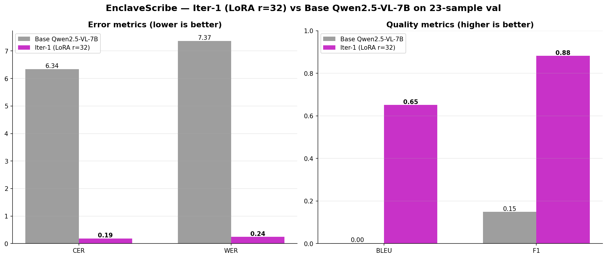

# EnclaveScribe — Iteration 1

**Fine-tuning Qwen2.5-VL-7B for document OCR on $1.40 of AWS spot compute.**



---

## TL;DR

| Metric | Base Qwen2.5-VL-7B | Iter-1 (LoRA r=32) | Change |
|---|---:|---:|---:|
| **CER** ↓ | 6.34 | **0.19** | −97% |
| **WER** ↓ | 7.37 | **0.24** | −97% |
| **BLEU** ↑ | 0.00 | **0.65** | +0.65 |
| **F1** ↑ | 0.15 | **0.88** | +0.73 |

Fine-tuned a 7B vision-language model on 4× A10G GPUs for 26 minutes and got a 97% CER reduction on the 23-sample val set. Whole training run cost about the price of a coffee.

**Honest caveat**: val is a random 2% split from the same distribution as train (CORD + FUNSD). Most of the gain is the model learning our specific output format — not raw OCR quality. Iter-2 will measure true generalization on a held-out test set.

---

## What we built

- **Base model**: [Qwen2.5-VL-7B-Instruct](https://huggingface.co/Qwen/Qwen2.5-VL-7B-Instruct)
- **Adapter**: LoRA r=32, α=64, 7 target modules (95.2M trainable params — 1.13% of 8.4B)
- **Data**: 1,174 receipts and forms (CORD + FUNSD)
- **Hardware**: 4× NVIDIA A10G 24GB on AWS g5.12xlarge spot
- **Runtime**: 26 minutes, effective batch size 32
- **Precision**: bf16 + Liger kernel + gradient checkpointing

## Training curves

Loss drops from 16.3 → 6.5 and plateaus after step ~20. Clear signal: the model saturated on this dataset early. Iter-2 needs more data, not more epochs.


Learning rate: clean cosine schedule with 5% warmup, exactly as configured.


Gradient norm: spike at start, stable below 1 by step 20 — no instability, no clipping needed.


## What broke along the way

Every one of these was a live crash on the instance. Total debug loop was probably 8 hours before the first clean run.

1. **Unsloth free tier is single-GPU** — all 4 torchrun processes piled onto GPU 0. Switched to HuggingFace Trainer + DDP across all 4 GPUs.
2. **lm_head OOM at bf16** — 152k vocab logits blew 22GB. Fix: Liger kernel to fuse `lm_head + cross_entropy` and skip materializing fp32 logits (~2GB saved).
3. **Image token mismatch** — Qwen's default `max_pixels` produces 11k+ tokens for large document scans, overflowing our 4096 cap. Fix: capped `max_pixels` at 640 patches, removed truncation in collator.
4. **Silent LoRA gradient failure** — gradient checkpointing + PEFT LoRA quietly stopped gradients flowing to adapters. Loss just stayed flat. Fix: `model.enable_input_require_grads()` + `use_reentrant=False`.
5. **Trainer dropped custom dataset columns** — `remove_unused_columns=False` required so the vision collator receives image data.

## Cost

| Item | Cost |
|---|---|
| Actual training compute (26 min × g5.12xlarge spot) | ~$1.40 |
| Data prep + debug loops (setup + failed runs on same instance) | ~$8 |
| Eval on 23 samples (2× A10G-hours) | ~$1 |
| **Total for iter-1 (soup to nuts)** | **~$10** |

## What's next — iter-2

Iter-1 proved the pipeline works. Iter-2 needs to prove the model *generalizes*, not just memorizes format.

**Priorities:**
1. **Reserve official test splits** — CORD test + FUNSD test never in training, use as stable benchmark forever
2. **Fix 3 broken prep pipelines** (XFUND, TextOCR, OmniDocBench) → target ~30k training samples across 5+ dataset types
3. **Prompt-per-dataset** — teach the model to switch output formats based on prompt ("extract receipt" vs "extract markdown" vs "extract form fields")
4. **LoRA r=64, 2 epochs** — more capacity, less repetition
5. **Real eval** — hold-out test + out-of-distribution documents

Estimated iter-2 compute: ~3-4 hours × g5.12xlarge spot ≈ $12-15.

---

## Links

- **W&B run**: https://wandb.ai/shashankbhardwaj2030-enclave-labs-inc/huggingface/runs/sljtr6bz
- **Repo**: https://github.com/Enclave-Labs-Inc/enclave-scribe
- **Adapter checkpoint**: `s3://enclave-scribe-checkpoints/outputs/iter1/`

## Reproduce

```bash
# Regenerate this report's images (needs W&B API key)
export WANDB_API_KEY=<your-key>
python scripts/export_wandb_pdf.py \
  --run shashankbhardwaj2030-enclave-labs-inc/huggingface/sljtr6bz \
  --out results/iter1_training_report.pdf \
  --png_dir reports/iter1

python scripts/plot_eval_comparison.py \
  --a results/iter1_val_base.json      --a_label "Base Qwen2.5-VL-7B" \
  --b results/iter1_val_finetuned.json --b_label "Iter-1 (LoRA r=32)" \
  --out reports/iter1/eval_comparison.png
```
